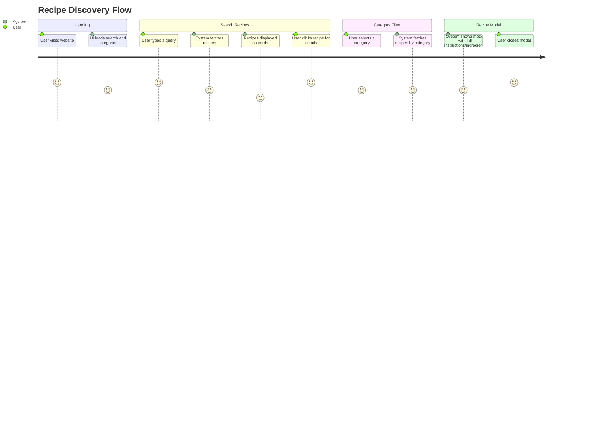

# YourKitchen App Documentation

YourKitchen is a modern, responsive web application that helps users discover, search, and filter recipes using [TheMealDB API](https://www.themealdb.com/). This documentation explains the structure, interactions, and style of the app, detailing the HTML, JavaScript, and CSS files.

---

## index.html

This file sets up the basic structure and UI for the YourKitchen app using semantic HTML5, including header, hero section, main content, and footer.

### Main Elements

| Element             | Description                                                                                   |
|---------------------|----------------------------------------------------------------------------------------------|
| `<header>`          | Displays the logo and app name using an icon and heading.                                    |
| `<section class="hero">` | Features the headline and a short tagline to introduce the app's purpose.                       |
| `<main>`            | Contains the search bar, category filter, and container where recipes get rendered.           |
| `<footer>`          | Shows a footer message with a heart icon for a friendly touch.                               |
| `<script src="script.js">` | Loads the JavaScript file for interactivity.                                                   |

### Key Features

- **Font Awesome** icons for visual appeal.
- Responsive container for all major sections.
- Search input and button for querying recipes.
- Dynamic category bar for filtering recipes by type.
- Placeholder `<div class="recContainer">` for recipe cards inserted by JS.
- Clean, accessible markup.

#### HTML Structure

```html
<!DOCTYPE html>
<html lang="en">
<head>
  <meta charset="UTF-8">
  <meta name="viewport" content="width=device-width, initial-scale=1.0">
  <title>YourKitchen App</title>
  <link rel="stylesheet" href="style.css">
  <link href="https://cdnjs.cloudflare.com/ajax/libs/font-awesome/6.0.0/css/all.min.css" rel="stylesheet">
</head>
<body>
  <header class="header">
    <div class="container">
      <div class="header-content">
        <div class="logo">
          <i class="fas fa-utensils"></i>
          <h1>YourKitchen</h1>
        </div>
      </div>
    </div>
  </header>
  <section class="hero">
    <div class="container hero-inner">
      <div class="hero-text">
        <h2>Discover Delicious Meals</h2>
        <p>Search thousands of recipes and filter by category to find your next favorite dish.</p>
      </div>
    </div>
  </section>
  <main class="main">
    <div class="container">
      <div class="search-section">
        <div class="search-box">
          <i class="fas fa-search"></i>
          <input type="text" id="searchInput" placeholder="Search for recipes...">
        </div>
        <button class="search-btn" id="searchBtn">
          <i class="fas fa-search"></i> Search
        </button>
      </div>
      <div class="category-bar" id="categoryBar"></div>
      <div class="recContainer"></div>
    </div>
  </main>
  <footer class="footer">
    <div class="container footer-inner">
      <p>Made with <i class="fas fa-heart"></i> for food lovers • YourKitchen</p>
    </div>
  </footer>
  <script src="script.js"></script>
</body>
</html>
```

---

## script.js

This JavaScript file powers the YourKitchen app. It handles API requests, renders recipe cards and modals, manages search and category selection, and provides dynamic UI interactivity.

### Core Logic

- **Recipe Search & Filtering:** Fetch recipes from TheMealDB based on search query or selected category.
- **Category Bar:** Dynamically loads categories and allows users to filter recipes by type.
- **Recipe Cards:** Renders recipe summaries with image, title, category, area, and short instructions.
- **Recipe Modal:** On "Get Recipe" click, displays a modal with full instructions and ingredients.
- **Error Handling:** User receives feedback if recipes can’t be loaded or are missing.

### Main Functions & Flow

#### Fetching Recipes

- **fetchRecipes(query)**: 
    - If a search query is provided, fetches recipes by name.
    - If a category is selected, fetches recipes by category.
    - Defaults to searching for "chicken" if no input or category is specified.
- **Error Handling:** Shows a message if fetch fails or no recipes are found.

#### Rendering Recipe Cards

- **renderCards(meals):**
    - Loops through recipe results.
    - Creates a card for each meal with image, meta info, and truncated instructions.
    - Adds a "Get Recipe" button for modal details.

#### Category Management

- **loadCategories():**
    - Fetches all available recipe categories.
    - Renders them as clickable chips in the UI.
    - Highlights the active category.

#### Modal Window

- **openRecipeModal(meal):**
    - Displays a modal with:
        - Large meal image.
        - Category and area.
        - List of ingredients and measures.
        - Full instructions.
    - Supports closing via button, overlay click, or Escape key.

#### Event Listeners

- **Search Button:** Triggers new search.
- **Enter Key:** Triggers search on input.
- **Category Chip Click:** Filters recipes by category.
- **"Get Recipe" Button:** Opens the modal with full details.

#### JavaScript Code Sample

```js
// Fetch and display recipes based on user input or category
async function fetchRecipes(query = '') {
    recContainer.innerHTML = "<div style='color:#fff;padding:14px'>Fetching dishes...</div>";
    let url;
    if (query) {
        url = `https://www.themealdb.com/api/json/v1/1/search.php?s=${encodeURIComponent(query)}`;
    } else if (currentCategory && currentCategory !== 'All') {
        url = `https://www.themealdb.com/api/json/v1/1/filter.php?c=${encodeURIComponent(currentCategory)}`;
    } else {
        url = `https://www.themealdb.com/api/json/v1/1/search.php?s=chicken`;
    }
    try {
        const res = await fetch(url);
        const data = await res.json();
        const meals = data.meals || [];
        if (!meals.length) {
            recContainer.innerHTML = "<div style='color:#fff;padding:14px'>No recipes found. Try another search or category.</div>";
            return;
        }
        renderCards(meals);
    } catch (e) {
        recContainer.innerHTML = "<div style='color:#fff;padding:14px'>Failed to fetch recipes. Please try again later.</div>";
    }
}
```

#### Data Flow Diagram

```mermaid
flowchart TD
    A[User interacts with UI] --> B{Search or Category?}
    B -- Search --> C[fetchRecipes(query)]
    B -- Category --> D[fetchRecipes() with category]
    B -- Neither --> E[fetch default recipes]
    C & D & E --> F[Render Cards (renderCards)]
    F --> G[User clicks "Get Recipe"]
    G --> H[Open Modal (openRecipeModal)]
    H --> I[User views ingredients/instructions]
```

---

## style.css

This stylesheet provides a modern and elegant look for the YourKitchen app. It uses gradients, subtle shadows, and responsive layouts for a delightful user experience.

### Main Style Features

- **Global Reset:** Ensures consistent box-sizing and removes default margins/paddings.
- **Typography:** Uses clean, easy-to-read sans-serif fonts.
- **Header & Hero:** Blur effects and bold, centered logos and taglines.
- **Search & Category Bar:** Rounded, shadowed search bar with category chips that highlight on selection.
- **Recipe Cards:** Responsive grid, card shadows, image scaling on hover, and meta tags.
- **Modals:** Overlay with blur effect, centered modal, responsive design for different screen sizes.
- **Footer:** Minimal, with a colored heart icon.

### Responsive Design

- **Grid adjustments:** Recipe cards stack vertically on small screens.
- **Modal scaling:** Modals shrink and rearrange for mobile views.
- **Font scaling:** Headings and paragraphs resize for better legibility on all devices.

#### Example Style Snippet

```css
.recContainer .recCard{
  position: relative;
  display: flex;
  flex-direction: column;
  align-items: stretch;
  padding: 16px;
  background: linear-gradient(180deg, rgba(255,255,255,0.65), rgba(255,255,255,0.45));
  border-radius: 18px;
  box-shadow: 0 10px 30px rgba(0, 0, 0, 0.18);
  transition: transform 0.25s ease, box-shadow 0.25s ease;
}
.recContainer .recCard:hover {
  transform: translateY(-6px);
  box-shadow: 0 18px 48px rgba(0, 0, 0, 0.28);
}
```

---

## External API Usage

The app interacts with [TheMealDB's public API](https://www.themealdb.com/api.php). Below are the endpoints used and their purposes.

### Endpoints Used

#### Search Recipes by Name

```api
{
    "title": "Search Recipes by Name",
    "description": "Returns meal(s) that match the search query.",
    "method": "GET",
    "baseUrl": "https://www.themealdb.com",
    "endpoint": "/api/json/v1/1/search.php",
    "headers": [],
    "queryParams": [
        {
            "key": "s",
            "value": "The meal name to search for",
            "required": true
        }
    ],
    "pathParams": [],
    "bodyType": "none",
    "requestBody": "",
    "responses": {
        "200": {
            "description": "Array of meal objects",
            "body": "{\n  \"meals\": [\n    { \"idMeal\": \"52772\", \"strMeal\": \"Teriyaki Chicken Casserole\", ... }\n  ]\n}"
        },
        "404": {
            "description": "No meals found",
            "body": "{\n  \"meals\": null\n}"
        }
    }
}
```

#### Filter Recipes by Category

```api
{
    "title": "Filter Recipes by Category",
    "description": "Returns meals in the selected category.",
    "method": "GET",
    "baseUrl": "https://www.themealdb.com",
    "endpoint": "/api/json/v1/1/filter.php",
    "headers": [],
    "queryParams": [
        {
            "key": "c",
            "value": "Category name",
            "required": true
        }
    ],
    "pathParams": [],
    "bodyType": "none",
    "requestBody": "",
    "responses": {
        "200": {
            "description": "Array of basic meal objects",
            "body": "{\n  \"meals\": [\n    { \"strMeal\": \"Beef and Mustard Pie\", \"strMealThumb\": \"...\", \"idMeal\": \"52874\" }, ...\n  ]\n}"
        }
    }
}
```

#### List All Categories

```api
{
    "title": "List All Categories",
    "description": "Returns all recipe categories.",
    "method": "GET",
    "baseUrl": "https://www.themealdb.com",
    "endpoint": "/api/json/v1/1/list.php",
    "headers": [],
    "queryParams": [
        {
            "key": "c",
            "value": "list",
            "required": true
        }
    ],
    "pathParams": [],
    "bodyType": "none",
    "requestBody": "",
    "responses": {
        "200": {
            "description": "Array of category objects",
            "body": "{\n  \"meals\": [ { \"strCategory\": \"Beef\" }, ... ]\n}"
        }
    }
}
```

#### Lookup Meal by ID

```api
{
    "title": "Lookup Meal by ID",
    "description": "Gets full details for a specific meal.",
    "method": "GET",
    "baseUrl": "https://www.themealdb.com",
    "endpoint": "/api/json/v1/1/lookup.php",
    "headers": [],
    "queryParams": [
        {
            "key": "i",
            "value": "Meal ID",
            "required": true
        }
    ],
    "pathParams": [],
    "bodyType": "none",
    "requestBody": "",
    "responses": {
        "200": {
            "description": "Meal object with full details",
            "body": "{\n  \"meals\": [ { \"idMeal\": \"52874\", \"strMeal\": \"Beef and Mustard Pie\", ... } ]\n}"
        }
    }
}
```

---

## User Journey



---

## Summary Table

| File         | Purpose                                            | Main Responsibilities                                             |
|--------------|----------------------------------------------------|-------------------------------------------------------------------|
| index.html   | Structure and layout                               | Defines app container, search, categories, footer                 |
| script.js    | Interactivity and data fetching                    | Handles API calls, UI updates, modal logic, event listeners       |
| style.css    | Visual styling and responsiveness                  | Styles all UI elements, handles layout across screen sizes        |

---

## 👨‍🍳 Final Notes

- **No build or package manager is needed**; the app runs as static HTML/JS/CSS.
- All data is fetched live from TheMealDB.
- The code is cleanly separated for easy customization and extension.
- The app is fully responsive and accessible.

Enjoy discovering new recipes and happy cooking with YourKitchen! 🍲